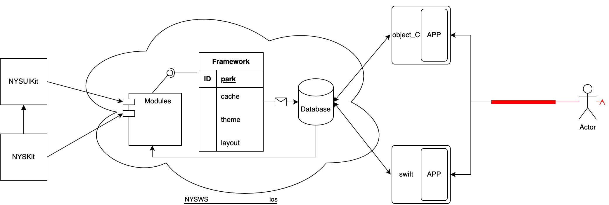

NYSKit
===
[](https://developer.apple.com/ios/)
[](https://github.com/niyongsheng/BaseClass_MVP_IOS/blob/master/LICENSE)
===

## Introduction:
> IOS应用快速构建框架。<br>
> Quick build [framework](#architecture) for IOS apps.


## Screenshot


## Features
- [x] [mvvm](https://en.wikipedia.org/wiki/Model–view–viewmodel)
- [x] [swiftUI](https://developer.apple.com/tutorials/sample-apps/)
- [x] [dark-mode](https://developer.apple.com/design/human-interface-guidelines/dark-mode/)
- [x] [localization](https://developer.apple.com/localization/)
- [x] [ad/qr/nav/net/map/mock/codable/cache/theme manager](https://github.com/niyongsheng/NYSWS/blob/main/NYSWS/NYSAppSwift/NYSAppSwift/README.md)

## Usage
```ruby
  pod 'NYSKit', :git => 'https://github.com/niyongsheng/NYSKit.git'
  pod 'NYSUIKit', :git => 'https://github.com/niyongsheng/NYSKit.git'

  pod install
```
```objectivec
  #import <NYSKit/NYSKit.h>
  #import <NYSUIKit/NYSUIKit.h>
```
```swift
  import NYSKit
  import NYSUIKit
```
`NYSKit Document:` https://niyongsheng.github.io/Document/NYSWS/NYSKit/index.html

`NYSUIKit Document:` https://niyongsheng.github.io/Document/NYSWS/NYSUIKit/index.html

`Example Project:`[NYSWS](https://github.com/niyongsheng/NYSWS)

## Architecture
```text
NYSKit
├─ NYSAppStorePay.h
├─ NYSAppStorePay.m
├─ NYSError.h
├─ NYSError.m
├─ NYSKeyChain.h
├─ NYSKeyChain.m
├─ NYSKit.h
├─ NYSKitManager.h
├─ NYSKitManager.m
├─ NYSKitPublicHeader.h
├─ NYSNetRequest.h
├─ NYSNetRequest.m
├─ NYSRegularCheck.h
├─ NYSRegularCheck.m
├─ NYSTools.h
└─ NYSTools.m
```
```text
NYSUIKit
├─ BaseClass
│    ├─ NYSBaseNavigationController.h
│    ├─ NYSBaseNavigationController.m
│    ├─ NYSBaseObject.h
│    ├─ NYSBaseObject.m
│    ├─ NYSBasePresenter.h
│    ├─ NYSBasePresenter.m
│    ├─ NYSBaseTabBarController.h
│    ├─ NYSBaseTabBarController.m
│    ├─ NYSBaseView.h
│    ├─ NYSBaseView.m
│    ├─ NYSBaseViewController.h
│    ├─ NYSBaseViewController.m
│    ├─ NYSBaseWindow.h
│    ├─ NYSBaseWindow.m
│    └─ WebViewController
│           ├─ NYSJSHandler.h
│           ├─ NYSJSHandler.m
│           ├─ NYSWebViewController.h
│           └─ NYSWebViewController.m
├─ Category
│    ├─ NSBundle+NYSFramework.h
│    ├─ NSBundle+NYSFramework.m
│    ├─ NSBundle+NYSLanguageSwitch.h
│    ├─ NSBundle+NYSLanguageSwitch.m
│    ├─ NSDictionary+NilSafe.h
│    ├─ NSDictionary+NilSafe.m
│    ├─ NSError+NYS.h
│    ├─ NSError+NYS.m
│    ├─ NSString+NYS.h
│    ├─ NSString+NYS.m
│    ├─ UIButton+NYS.h
│    ├─ UIButton+NYS.m
│    ├─ UIColor+NYS.h
│    ├─ UIColor+NYS.m
│    ├─ UIImage+NYS.h
│    ├─ UIImage+NYS.m
│    ├─ UINavigationController+FDFullscreenPopGesture.h
│    ├─ UINavigationController+FDFullscreenPopGesture.m
│    ├─ UINavigationController+NYS.h
│    ├─ UINavigationController+NYS.m
│    ├─ UIScrollView+EmptyDataSet.h
│    ├─ UIScrollView+EmptyDataSet.m
│    ├─ UITextField+NYS.h
│    ├─ UITextField+NYS.m
│    ├─ UIView+NYS.h
│    └─ UIView+NYS.m
├─ Manager
│    └─ ThemeManager
│           ├─ README.md
│           ├─ ThemeManager.h
│           └─ ThemeManager.m
├─ NYSUIKit.h
├─ NYSUIKitPublicHeader.h
├─ Resources
│    ├─ NYSUIKit.bundle
│    │    ├─ Info.plist
│    │    ├─ en.lproj
│    │    ├─ lao.lproj
│    │    ├─ zh-Hans.lproj
│    │    └─ zh-Hant.lproj
│    ├─ NYSUIKit.xcassets
│    │    ├─ Contents.json
│    │    ├─ EmptyData
│    │    ├─ Refresh
│    │    ├─ Theme
│    │    └─ TopBar
│    ├─ douyuFont.otf
│    └─ load_error.html
├─ UI
│    ├─ BFPaperCheckbox
│    │    ├─ BFPaperCheckbox.h
│    │    └─ BFPaperCheckbox.m
│    ├─ CMPopTipView
│    │    ├─ CMPopTipView.h
│    │    └─ CMPopTipView.m
│    ├─ LEETheme
│    │    ├─ LEETheme.h
│    │    ├─ LEETheme.m
│    │    └─ LEEThemeHelper.h
│    ├─ NYSBlugeTabBar
│    │    ├─ NYSBlugeTabBar.h
│    │    └─ NYSBlugeTabBar.m
│    ├─ NYSBubbleButton
│    │    ├─ NYSBubbleButton.h
│    │    └─ NYSBubbleButton.m
│    ├─ NYSFirVersionCheck
│    │    ├─ NYSFirVersionCheck.h
│    │    └─ NYSFirVersionCheck.m
│    ├─ NYSIconLeftButton
│    │    ├─ NYSIconLeftButton.h
│    │    └─ NYSIconLeftButton.m
│    ├─ NYSLabel
│    │    ├─ NYSLabel.h
│    │    └─ NYSLabel.m
│    ├─ NYSLoadingButton
│    │    ├─ NYSLoadingButton.h
│    │    └─ NYSLoadingButton.m
│    ├─ NYSLocation
│    │    ├─ NYSLocationTransform.h
│    │    ├─ NYSLocationTransform.m
│    │    ├─ NYSSystemLocation.h
│    │    └─ NYSSystemLocation.m
│    ├─ NYSMemoryLabel
│    │    ├─ NYSMemoryLabel.h
│    │    └─ NYSMemoryLabel.m
│    ├─ NYSPopView
│    │    ├─ NYSPopAnimationTool.h
│    │    ├─ NYSPopAnimationTool.m
│    │    ├─ NYSPopView.h
│    │    └─ NYSPopView.m
│    ├─ NYSScrollLabel
│    │    ├─ NYSScrollLabel.h
│    │    └─ NYSScrollLabel.m
│    ├─ NYSTableViewAnimation
│    │    ├─ NYSTableViewAnimation.h
│    │    └─ NYSTableViewAnimation.m
│    └─ YYFPSLabel
│           ├─ YYFPSLabel.h
│           └─ YYFPSLabel.m
└─ Utilities
       ├─ NYSUIKitUtilities.h
       └─ NYSUIKitUtilities.m
```

## Remind
① `ARC`<br>
② `Cocoapods`<br>
③ `iPhone\iPad`<br>
④ `iOS >= 13.0`<br>
⑤ `Xcode >= 14.0`<br>

## Contribution
Reward[:lollipop:](https://github.com/niyongsheng/niyongsheng.github.io/blob/master/Beg/README.md)  Encourage[:heart:](https://github.com/niyongsheng/NYSKit/stargazers)

## Contact Me
* E-mail: niyongsheng@Outlook.com
* Weibo: [@Ni永胜](https://weibo.com/u/7317805089)
